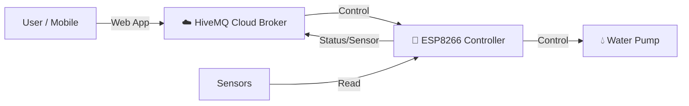

# 🌊 Smart Water Pump Control System
> ระบบควบคุมและติดตามระดับน้ำอัจฉริยะผ่านเว็บแอปพลิเคชัน

---

## 1. 🎯 บทนำและที่มา (Introduction)
ในปัจจุบันการบริหารจัดการน้ำในครัวเรือนหรือการเกษตรมักประสบปัญหาการลืมปิดปั๊มน้ำ ทำให้น้ำล้นถัง หรือปั๊มน้ำทำงานในขณะที่ไม่มีน้ำ (Dry Run) ซึ่งอาจทำให้ปั๊มเสียหายได้

**"Smart Water Pump Control System"** คือคำตอบที่จะช่วยแก้ปัญหานี้ ด้วยระบบอัตโนมัติที่สามารถ:
- 👁️ **Monitor**: ดูระดับน้ำได้แบบ Real-time จากทุกที่ผ่านมือถือ
- 🎮 **Control**: สั่งงานปั๊มน้ำได้ทั้งแบบ Manual, ตั้งเวลา, และอัตโนมัติ
- 🛡️ **Protect**: มีระบบป้องกันความปลอดภัย ตัดการทำงานเมื่อน้ำแห้งหรือเต็ม

---

## 2. 🏗️ สถาปัตยกรรมระบบ (System Architecture)

ระบบทำงานแบบ **IoT (Internet of Things)** โดยเชื่อมต่อระหว่างฮาร์ดแวร์และซอฟต์แวร์ผ่าน Cloud MQTT

### องค์ประกอบหลัก:
1.  **Hardware Node (Edge):** ควบคุมอุปกรณ์และอ่านค่าเซนเซอร์
2.  **Cloud Broker (Middleware):** ตัวกลางรับส่งข้อมูล (HiveMQ)
3.  **Web Dashboard (Client):** หน้าจอสำหรับผู้ใช้งาน

---

## 3. ✨ ฟีเจอร์หลัก (Key Features)

### 3.1 🌊 Real-time Monitoring
- แสดงระดับน้ำในถัง **Park (บน)** และ **Pub (ล่าง)** ด้วย Animation เสมือนจริง
- แสดงสถานะการทำงานของปั๊ม (ON/OFF)

### 3.2 🎮 3 Control Modes (โหมดการทำงาน)
1.  **Auto Mode 🤖**: ระบบทำงานอัตโนมัติตามระดับน้ำ (น้ำเต็มตัด, น้ำพร่องเติม)
2.  **Timer Mode ⏰**: ตั้งเวลาเปิด-ปิดปั๊มได้ตามวันและเวลาที่กำหนด (เช่น รดน้ำต้นไม้ทุกเช้า จันทร์-ศุกร์)
3.  **Manual Mode 👆**: สั่งเปิด-ปิดด้วยมือผ่านแอปพลิเคชัน หรือปุ่มกดที่หน้างาน

### 3.3 🛡️ Safety Mechanisms (ระบบความปลอดภัย)
- **Dry Run Protection**: ตัดการทำงานทันทีถ้าน้ำต้นทาง (Pub) หมด
- **Overflow Protection**: ตัดการทำงานทันทีถ้าน้ำปลายทาง (Park) เต็ม
- **Sensor Validation**: ตรวจสอบความถูกต้องของเซนเซอร์ (รองรับทั้ง Digital และ Ultrasonic)

---

## 4. 🛠️ เทคโนโลยีที่ใช้ (Tech Stack)

### 🔌 Hardware & Firmware
- **Microcontroller**: ESP8266 (NodeMCU)
- **Framework**: Arduino (C++)
- **Sensors**: Digital Level Sensors (Float switches), Ultrasonic HC-SR04 (Future)
- **Libraries**: `TaskScheduler` (Multitasking), `PubSubClient` (MQTT)

### 💻 Frontend (Web Dashboard)
- **Framework**: React + Vite
- **UI Library**: Material UI (MUI)
- **Protocol**: MQTT over WebSocket (wss)
- **Deployment**: GitHub Pages

---

## 5. 📱 การใช้งาน (User Interface)

หน้าจอ Web Dashboard ถูกออกแบบให้ใช้งานง่าย (User Friendly) และรองรับ Responsive (ใช้ได้ทั้งมือถือและคอมพิวเตอร์)

- **Animated Tanks**: กราฟิกถังน้ำที่มีคลื่นน้ำเคลื่อนไหวตามระดับจริง
- **Status Badges**: ป้ายสถานะสีต่างๆ บอกสถานะการเชื่อมต่อและโหมดการทำงาน
- **Control Panel**: ปุ่มสวิตช์ขนาดใหญ่สำหรับเปิดปิดปั๊มและโหมด Auto

---

## 6. 🚀 การพัฒนาในอนาคต (Future Roadmap)

- [ ] **Hybrid Sensors**: ใช้งาน Ultrasonic ร่วมกับ Digital Sensors เพื่อความแม่นยำสูงสุด
- [ ] **Line Notify**: แจ้งเตือนผ่าน Line เมื่อน้ำใกล้หมดหรือปั๊มมีปัญหา
- [ ] **Data Logging**: เก็บสถิติการใช้น้ำและเวลาปั๊มทำงานย้อนหลัง

---

> **Project by:** [ชื่อทีม/ชื่อผู้จัดทำ]
> **Date:** January 2026
