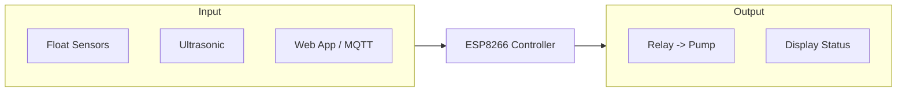

# โครงร่างรายงานผลการประดิษฐ์สิ่งประดิษฐ์ทางวิทยาศาสตร์
**ชื่อสิ่งประดิษฐ์:** ระบบบริหารจัดการน้ำอัจฉริยะแบบไฮบริดผ่านเครือข่าย IoT (Smart Hybrid Water Management System via IoT)
**ประเภท:** อาหารและการเกษตรกรรม (Food and Agriculture)

---

## 1. ปก (Cover Info)
*   **ชื่อสิ่งประดิษฐ์:** ระบบบริหารจัดการน้ำอัจฉริยะแบบไฮบริดผ่านเครือข่าย IoT
*   **คณะผู้จัดทำ:** (รอระบุชื่อนักเรียน 2 คน)
*   **ครูที่ปรึกษา:** (รอระบุชื่อครู)
*   **โรงเรียน:** (รอระบุโรงเรียน)

---

## 2. บทคัดย่อ (Abstract)
สิ่งประดิษฐ์นี้จัดทำขึ้นเพื่อแก้ปัญหาการบริหารจัดการน้ำในครัวเรือนและเกษตรกรรม โดยเฉพาะปัญหาการลืมปิดปั๊มน้ำทำให้น้ำล้นเสียเปล่า หรือปั๊มทำงานขณะน้ำแห้งจนเสียหาย ระบบนี้ใช้บอร์ดสมองกลฝังตัว ESP8266 ทำงานร่วมกับเซนเซอร์วัดระดับน้ำ 2 ระบบ (Dual Sensor System) คือ เซนเซอร์ลูกลอยและอัลตราโซนิก เพื่อความแม่นยำและระบบสำรองกันความผิดพลาด (Fail-safe)

ระบบสามารถควบคุมได้ 3 โหมด คือ 1. โหมดอัตโนมัติ (Auto) ทำงานตามระดับน้ำ 2. โหมดตั้งเวลา (Timer) และ 3. โหมดสั่งงานด้วยมือ (Manual) โดยผู้ใช้สามารถติดตามสถานะระดับน้ำแบบ Real-time และสั่งงานผ่าน Web Application ได้จากทุกที่ทั่วโลก ผลการทดสอบพบว่าระบบสามารถป้องกันปั๊มเสียหายจากการทำงานตัวเปล่า (Dry Run) และป้องกันน้ำล้นได้ 100% ช่วยลดการสูญเสียทรัพยากรน้ำและพลังงานไฟฟ้าได้อย่างมีประสิทธิภาพ

---

## 3. ความเป็นมาและแรงบันดาลใจ (Background & Inspiration)
ในปัจจุบัน เกษตรกรและผู้ใช้งานตามบ้านเรือนมักประสบปัญหาเรื่องการจัดการน้ำ การสูบน้ำขึ้นถังพักมักต้องคอยเฝ้าดู หากลืมปิดจะทำให้น้ำล้น สูญเสียทรัพยากรน้ำและค่าไฟฟ้า หรือหากน้ำต้นทางแห้งแต่ปั๊มยังทำงาน (Dry Run) จะทำให้มอเตอร์ไหม้เสียหายได้

คณะผู้จัดทำจึงมีแนวคิดประดิษฐ์ "ระบบบริหารจัดการน้ำอัจฉริยะ" ที่นำเทคโนโลยี IoT (Internet of Things) มาช่วยแก้ปัญหา โดยเน้นความเสถียรของระบบด้วยการใช้เซนเซอร์แบบไฮบริด (Hybrid Sensors) และมีระบบ Web Dashboard ที่แสดงผลเป็น Animation เข้าใจง่าย เพื่อให้ผู้ใช้งานทุกวัยสามารถใช้งานได้สะดวก สอดคล้องกับแนวคิด Smart Farm และ Smart Home

---

## 4. วัตถุประสงค์ (Objectives)
1.  เพื่อประดิษฐ์ระบบควบคุมปั๊มน้ำอัตโนมัติที่สามารถสั่งงานผ่านอินเทอร์เน็ตได้
2.  เพื่อป้องกันความเสียหายของปั๊มน้ำกรณีน้ำแห้ง (Dry Run Protection) และป้องกันน้ำล้นถัง (Overflow Protection)
3.  เพื่อสร้างระบบติดตามระดับน้ำ (Monitoring) ที่มีความแม่นยำสูงด้วยเซนเซอร์ 2 ระบบ
4.  เพื่อช่วยประหยัดน้ำและพลังงานไฟฟ้าในครัวเรือนและการเกษตร

---

## 5. วัสดุที่ใช้ (Materials)

| ลำดับ | รายการ | จำนวน | หน้าที่ |
| :--- | :--- | :--- | :--- |
| 1 | บอร์ด ESP8266 (NodeMCU) | 1 บอร์ด | หน่วยประมวลผลหลักและเชื่อมต่อ WiFi |
| 2 | เซนเซอร์วัดระดับน้ำ (Float Switch) | 4 ตัว | วัดระดับน้ำ สูง/ต่ำ ทั้งถังพักและถังเก็บ |
| 3 | เซนเซอร์ Ultrasonic (HC-SR04) | 2 ตัว | วัดระดับน้ำแบบละเอียด 0-100% (ส่วนขยาย) |
| 4 | รีเลย์ (Relay Module) | 1 ตัว | สวิตช์ตัดต่อไฟเลี้ยงปั๊มน้ำ |
| 5 | ปั๊มน้ำ DC 12V | 1 ตัว | ปั๊มน้ำสำหรับทดสอบระบบ |
| 6 | โมดูลแปลงไฟ (Power Supply) | 1 ชุด | จ่ายไฟให้ระบบควบคุม |
| 7 | โครงสร้างจำลองถังน้ำ | 1 ชุด | จำลองระบบถังน้ำบนดินและถังพัก |

---

## 6. งบประมาณ (Budget)
*   ค่าวัสดุอิเล็กทรอนิกส์: ประมาณ 500 บาท
*   ค่าโครงสร้างและวัสดุสิ้นเปลือง: ประมาณ 300 บาท
*   **รวมทั้งสิ้น: ประมาณ 800 บาท** (ไม่รวมค่าแรงและอุปกรณ์ที่มีอยู่แล้ว)

---

## 7. ขั้นตอนการผลิตและวิธีใช้ (Production & Usage)

### ขั้นตอนการผลิต
1.  **ออกแบบวงจร:** ออกแบบการเชื่อมต่อระหว่าง ESP8266 กับเซนเซอร์และรีเลย์
2.  **พัฒนาซอฟต์แวร์ (Firmware):** เขียนโปรแกรมด้วย Arduino IDE โดยใช้ระบบ Multi-tasking (TaskScheduler) เพื่อให้อ่านค่าเซนเซอร์และรับคำสั่ง MQTT ได้พร้อมกัน
3.  **พัฒนาส่วนแสดงผล (Frontend):** เขียน Web Application ด้วย React เพื่อแสดงผลระดับน้ำแบบ Animation และปุ่มควบคุม
4.  **ประกอบโครงสร้าง:** ติดตั้งเซนเซอร์ลงในถังน้ำจำลอง และเดินสายไฟเก็บงานให้เรียบร้อย
5.  **ทดสอบและปรับปรุง:** ทดสอบการทำงานทั้ง 3 โหมด และจำลองสถานการณ์น้ำแห้ง/น้ำล้น

### วิธีการใช้งาน
1.  **การเริ่มต้น:** เสียบปลั๊กไฟ ระบบจะเชื่อมต่อ WiFi และเริ่มทำงานอัตโนมัติ
2.  **การดูสถานะ:** เปิด Web App ผ่านมือถือ จะเห็นระดับน้ำในถัง Park (บน) และ Pub (ล่าง)
3.  **การควบคุม:**
    *   เลือกโหมด "Auto" เพื่อให้ระบบทำงานเอง
    *   เลือก "Timer" เพื่อตั้งเวลาทำงาน
    *   กดปุ่ม "On/Off" เพื่อสั่งงานทันที

---

## 8. แผนภาพและหลักการทำงาน (Diagrams & Principles)

### หลักการทางวิทยาศาสตร์
1.  **หลักการของไหล (Fluid Mechanics):** การใช้แรงดันน้ำในการกระตุ้นลูกลอย (Buoyancy)
2.  **หลักการสะท้อนคลื่นเสียง (Ultrasonic):** คำนวณระยะทางจากเวลาที่คลื่นเสียงเดินทางไปและกลับ ($d = v \times t / 2$) เพื่อหาระดับน้ำ

### System Block Diagram

### การทำงานของระบบควบคุม (Logic Flow)
*   **เงื่อนไขเปิดปั๊ม (AND):** (โหมด Auto เปิด) + (น้ำถังบนไม่เต็ม) + (น้ำถังล่างมีพอ)
*   **เงื่อนไขหยุดปั๊ม (OR):** (น้ำถังบนเต็ม) หรือ (น้ำถังล่างแห้ง) หรือ (สั่งปิดด้วยมือ)

---

## 9. ขนาดและน้ำหนัก (Size & Weight)
*   **ขนาด:** กว้าง 30 ซม. x ยาว 40 ซม. x สูง 45 ซม. (อยู่ในเกณฑ์ไม่เกิน 1x0.5x0.5 เมตร)
*   **น้ำหนัก:** 3.5 กิโลกรัม (อยู่ในเกณฑ์ไม่เกิน 10 กิโลกรัม)

---

## 10. จุดเด่นและประโยชน์ (Highlights & Benefits)
1.  **Hybrid Technology:** ใช้เซนเซอร์ 2 แบบทำงานร่วมกัน เพื่อความแม่นยำและทนทานกว่าระบบทั่วไป
2.  **User-Centric Design:** หน้าจอ Web App ออกแบบให้มี Animation คลื่นน้ำสมจริง เข้าใจง่ายกว่าตัวเลข
3.  **Safety First:** มีระบบป้องกันความเสียหายหลายชั้น (Software & Hardware Interlock)
4.  **Low Cost:** ใช้งบประมาณน้อยแต่ได้ประสิทธิภาพเทียบเท่าระบบอุตสาหกรรม

---

*หมายเหตุ: ข้อมูลในส่วนภาคผนวก (รูปถ่าย/ภาพร่าง) จะต้องดำเนินการถ่ายภาพจากชิ้นงานจริงใส่เพิ่มเติม*
